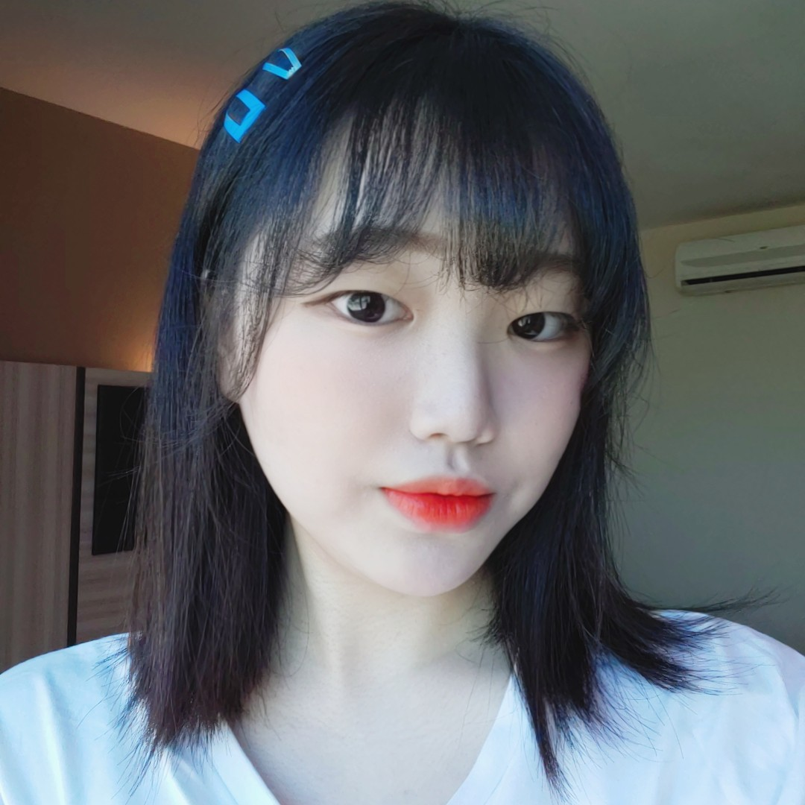
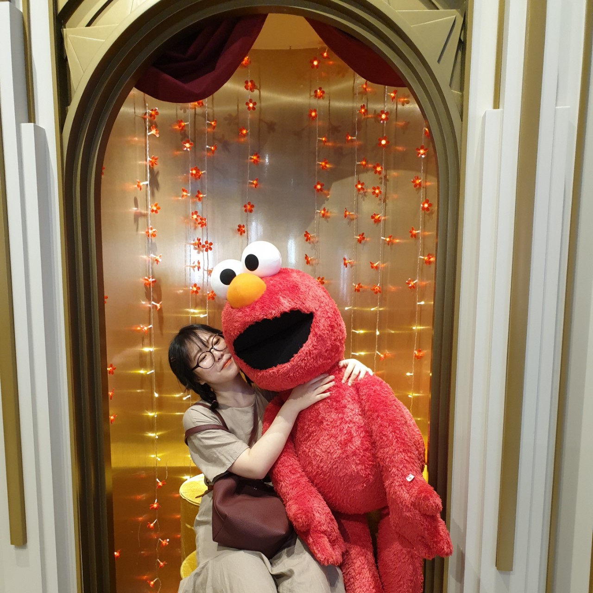
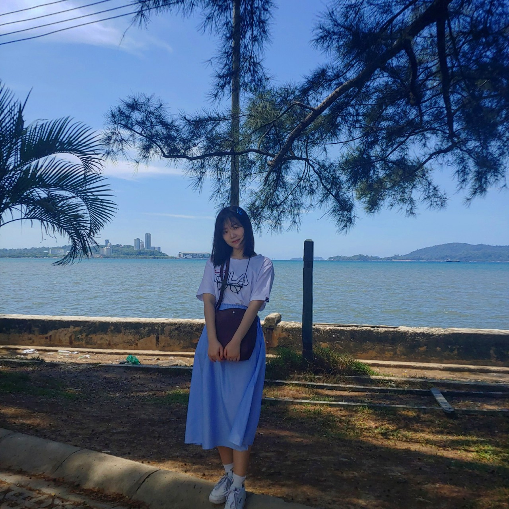
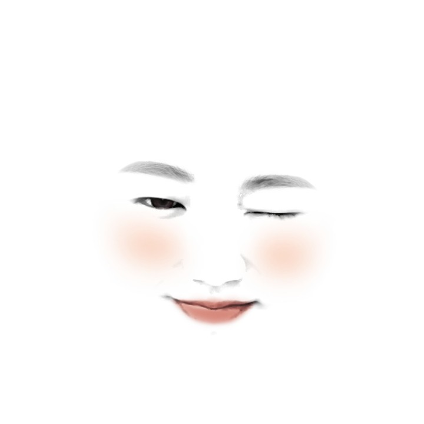

# ACPU1

<html>
<head>
  <title>ACPU인물소개-박지선</title>
  <meta charset="utf-8">
  </head>
  <body>

<h1>박지선</h1>
   
 
 
 
 
  
<h3>나이, 출생 : 18세, 2002년 9월 7일 
국적 : 대한민국 
취미 : 영화 보기 
꿈 : <u><strong>월세받는 백수</strong></u> 
동아리에서 느끼는 한줄평 :맨날 늦는 친구 
좋아하는 음식 : 단무지 
좋아하는 동물 : 햄스터, 고양이, 강아지 
좋아하는 색깔 : 노란색, 보라색 
좋아하는 노래 : 2002 
버킷리스트 
1. 삭발하기 
2. 고양이 키우기  
3. 골든 리트리버 키우기 
4. 나 좋아하는 사람이랑 결혼하기 
5. 백만장자 
키 : 186 
그 외 : 엑소팬-엑소엘 </h3>

</body>
